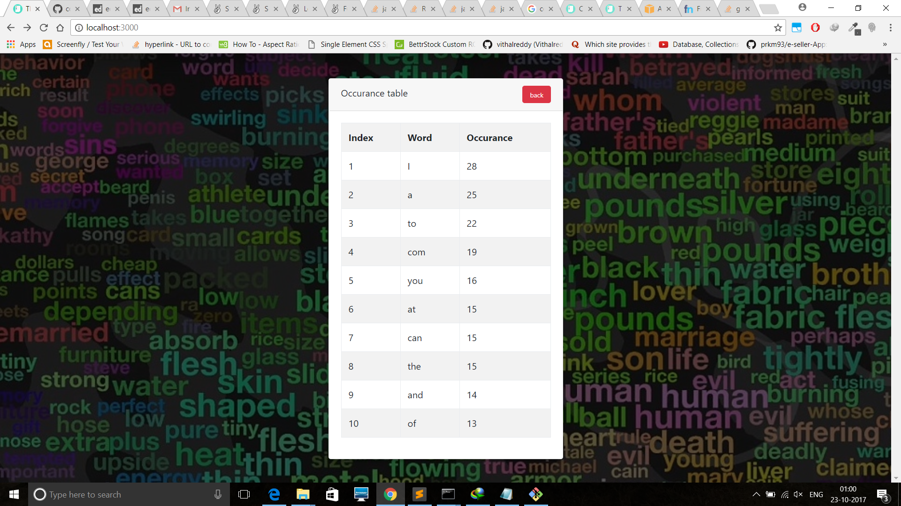
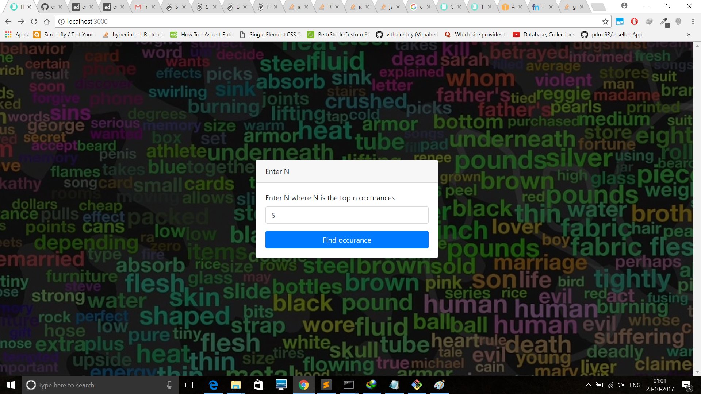
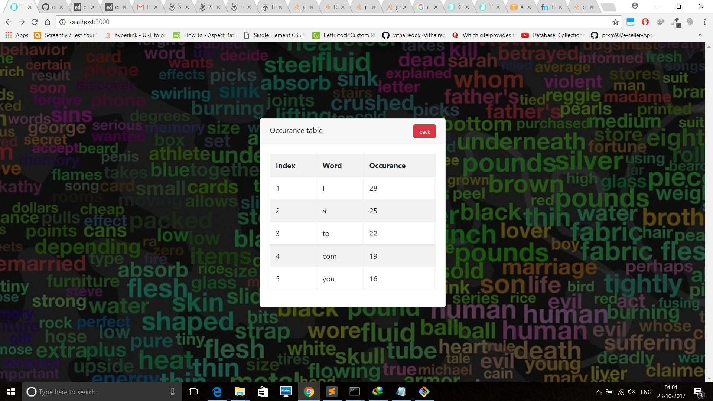
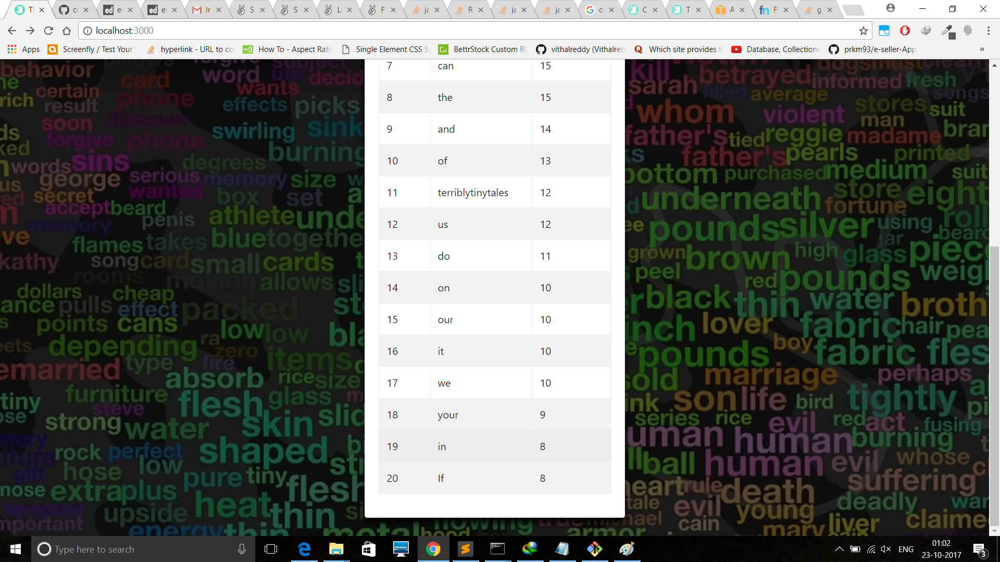

# Finding the number of occurances from a text link

## Domain pointed to cloud server using route 53

[wordoccur.tk](http://wordoccur.tk/ "Finding the number of occurances from a text link")

## Note

Kept it as simple as i could. Didnot break into mvc format because the code is just a few lines.

## Components

* Server - app.js

```	
	1) Request module used to get the data from the remote url
	2) Regular expression used to match all words including ' and -
	3) Compare the words in sequence from the array of the words
	  and check how may times they occur in the whole array.
	4) Donot compare if word has already been compared before.
	5) Sort the array and slice by the value of N.
```

* Front end - app.js
```
	1) Contains show and hide functions
	2) Contains function to request to get occurances api
```

* Front end - HTML(index.html)
```
	1)Contains 2 cards, one which takes N as input and other displays the occurances
	2) It contains a loader as a filler while the server fetches the file and computes the occurances
```

## ScreenShots







## Built With

* Bootstrap
* nodejs
* Sublime Text

## Versioning

The Invigilator version 1.0

## Authors

* **Vivek Shankar** 